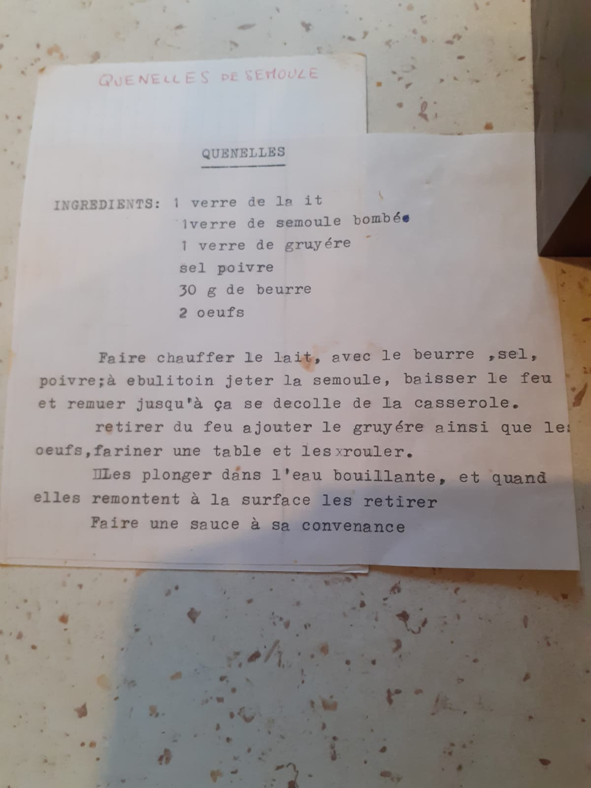

# Quenelle de semoule

# Ingrédients

- 175 g de semoule
- 250 g de lait
- 75 g de fromage rapé
- 30 g de beurre
- 2 œufs
- sel et poivre

# Étapes

1. Faire bouillir le sel, le poivre, le lait et le beurre
2. Dès que le mélange est à ébullition, ajouter la semoule et incorporer jusqu'à
   ce que le mélange devienne pâteux; la semoule doit être cuite
3. Incorporer le fromage rapé
4. Incorporer les deux œufs et mélanger pour que la pâte soit bien homogène
5. Rouler des quenelles dans la farine
6. Les cuire dans l'eau bouillante; les quenelles remontent à la surface
   lorsqu'elle sont cuites

# Astuces

- Vous pouvez congeler les quenelles mais faites les cuire dans l'eau bouillante
  avant
- Pour arômatiser vos quenelles, vous pouvez utiliser du jambon, du poulet fumé
  en le mixant très petit et en le mélangeant à la pâte

# Source

